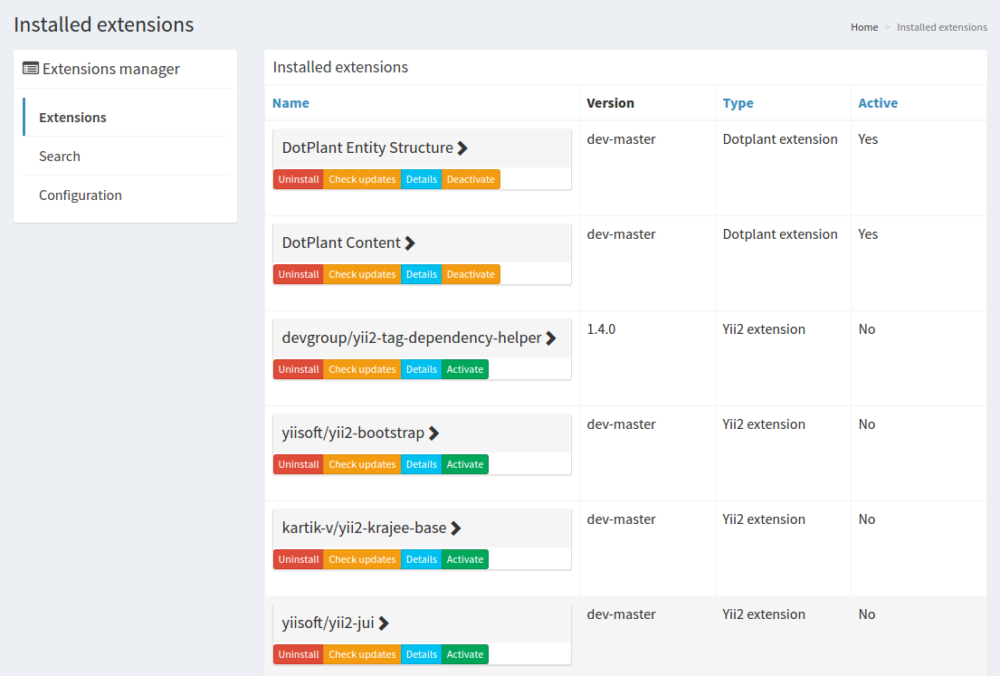
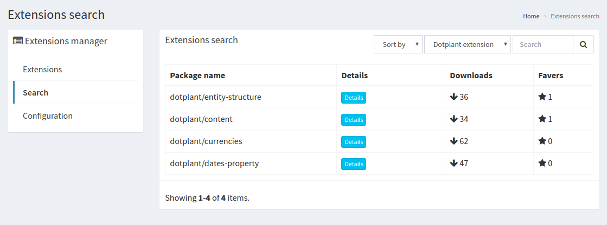
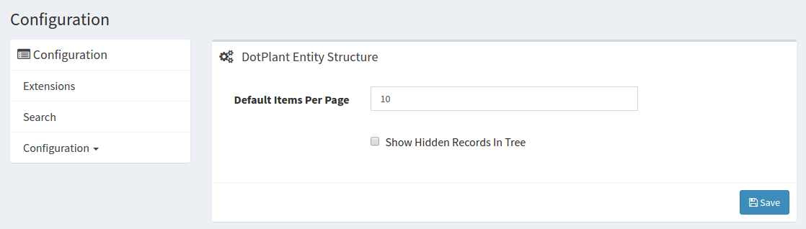

Backend
=======

В backend-е расширения доступны следующие страницы.

## Extensions

На этой странице отображаются все установленные расширения. Над ними доступны следующие операции

- Uninstall - удалить расширение
- Check updates - проверить на наличие обновлений (в разработке)
- Detail - просмотреть информацию о пакете
- Activate - активировать расширение (актуально только для dotplant-extension. Применяются миграции и обновляются файлы конфигураций приложения)
- Deactivate - деактивировать расширение (актуально только для dotplant-extension. Откатываются миграции и обновляются файлы конфигураций приложения)

## Search

Страница содержит строку поиска с возможностью ввода ключевых слов и выбора типа расширения. Поиск осуществляется через Packagist API.

Для установки необходимо нажать кнопку `Details` и в загруженном контенте нажать `Install`.

После установки приложение можно найти на странице `Extensions`. И там активировать его.

> **Важно.**
> 
> Если `yii2-extension` требует применения миграций, то это необходимо выполнить вручную.
> 
> Для `dotplant-extension` это произойдет автоматически при активации.

## Configuration

Страница редактирования настроек установленных расширений.

При переходе на данную страницу в левом меню становится доступно подменю с установленными `dotplant-extension`-ами. Через него осуществляется навигация между формами конфигурации расширений.
